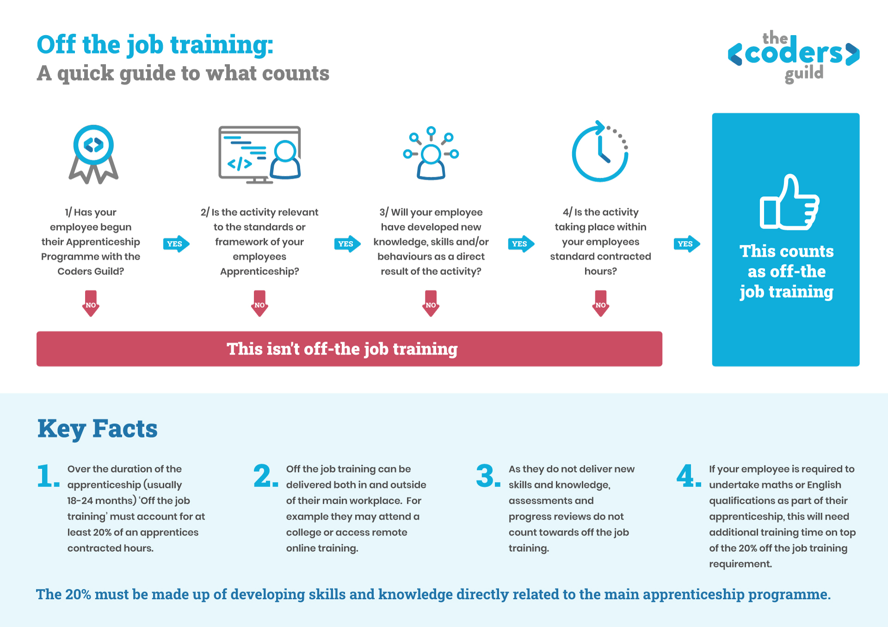

One of the first questions you likely had when considering an Apprenticeship programme was ‘How much time will the apprenticeship take up?"...and this is a really valid question!

As part of the apprenticeship programme, apprentices are required to have 20% of their contracted hours dedicated to learning and actively working towards their apprenticeship programme.

Whilst 20% pretty quickly sounds like you may be losing your full time hire a day each week to training and images of ‘day release’ programmes may well spring to mind, it doesn’t have to be that way and often isn’t even practical or conducive for Apprentices to have training delivered in such a rigid way.

Although the 20% is non-negotiable, how you reach that 20% is an agreement between you and your training provider, and your training provider will be able to give you advice on how they find works best, to not only meet the 20% requirement but also make the most of that time you are allocating, so your apprentices can become better at their job, quicker!

How that often looks for our Web and Software Developer Apprentices is a mixture of;

Study of Theory 

* ‘Classroom’ based lessons either remote online learning, in person learning or even a mixture of the two.

* Online learning provided by specialists in their field (outside of The Coders Guild)

* Simulations and Role Play exercises

* Supplier or Manufacturer training

* One to one coaching time with Industry coaches organised and provided by The Coders Guild

Practical Training and CPD Opportunities

* Shadowing more experienced members of staff within the workplace

* Being part of a mentor programme

* Industry events 

* Competitions

As a training provider specialising in the Tech industry, we know how important it is to have your new trainees up and running as soon as possible, which is why we plan our training curriculum around establishing the basics early and thoroughly and with your company needs in mind.

As a result of early planning and ongoing consultation, we normally find that in the early days of the programme, nearer 70% (possibly even higher) of your apprentice’s time will be spent in ‘Off The Job’ training.  

Learning the basics of their role, shadowing senior members of staff and maybe running through online training are activities that are expected for new staff members (irrespective of their Apprenticeship status)  and all count towards the magical 20% figure and onboarding an appropriately prepared new team member.

Towards the end of their apprenticeship as they become more confident and competent, we generally find that as little as 5 or 10% of their time may be dedicated to off the job training, but so long as they have achieved 20% on average throughout the programme, they will have met the requirements of the programme and should be showing the capability to carry out their job to competent standard and can then enjoy the more specific professional development activities that you promote as an organisation.

Here is a quick guide to what counts as ‘Off The Job’ Training.

If you would like any more information about Apprenticeships or Training and how it could work for you and your business, <a href="" class="text-blue-200 font-bold" data-modal="book-a-call">get in touch</a>.

